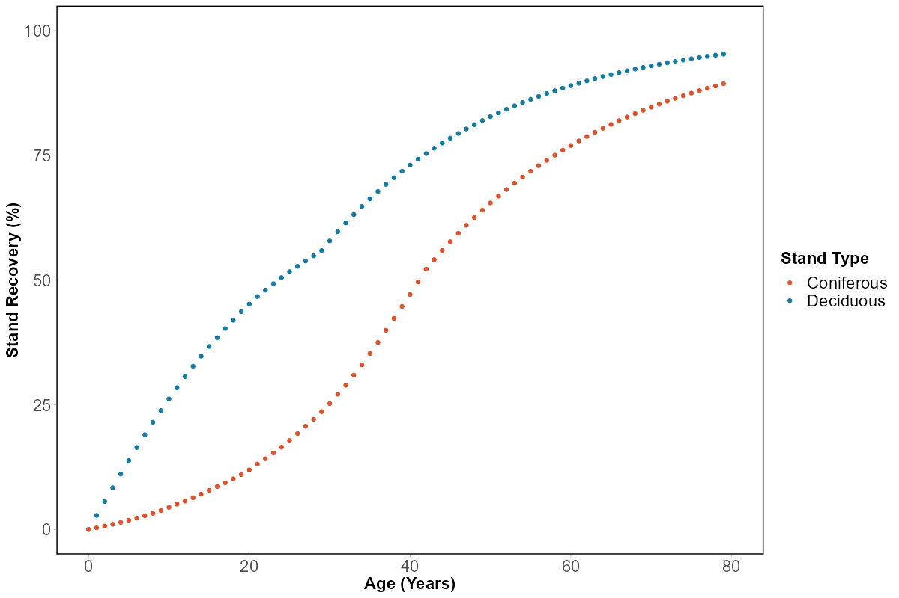

# Native Cover Indicator
  
## GIS Layers

The following GIS layers were used to delineate native habitat:

1) **The ABMI Wetland Inventory** is a provincial scale [GIS layer](https://www.abmi.ca/home/data-analytics/da-top/da-product-overview/Advanced-Landcover-Prediction-and-Habitat-Assessment--ALPHA--Products/ABMI-Wetland-Inventory.html) that identifies four classes of wetlands (bogs, fens, marsh, and swamps) and open water. This inventory was developed using open access Sentinal-1 and -2 data and machine learning algorithms [@DeLancey2019; @DeLancey2020]. Due to differences in the types of wetland distributed across Alberta, this layer was divided into three analysis regions (Boreal and Foothills, Prairie, and Rocky Mountain. 

2) **The Lotic Riparian Digital Elevation Model (DEM)** is a provincial scale [GIS layer](https://open.alberta.ca/opendata/gda-14e2b4a7-aca7-4ba9-b9ed-fbe8b0ffe5b9) that delineates riparian areas adjacent to streams, rivers, wetlands, and lakes. This layer was used to improve the delineation of aquatic habitat not captured by the **ABMI Wetland Inventory**.

3) **The Human Footprint Inventory** is a provincial scale [GIS layer](https://www.abmi.ca/home/data-analytics/da-top/da-product-overview/Human-Footprint-Products/HF-inventory.html) that consolidates 115 types of anthropogenic disturbance into 20 subcategories. This layer allowed us to determine the loss of native habitat due to anthropogenic disturbance.

4) **Hierarchical Watershed Boundaries of Alberta** The Hydrologic Unit Code Watersheds of Alberta layer allows us to aggregate the status of AWNC and TNC based on ecologically relevant boundaries ([Hydrologic Unit Code Watersheds of Alberta](https://open.alberta.ca/opendata/gda-7857b6fb-96c5-4bc5-ac3a-9017778fd183)). We chose to aggregate the information at the HUC-8 watershed scale. Each HUC-8 watershed contains both AWNC and TNC, with TNC ranging between 3.5% to 94% across watersheds. However, these indicators can be reported at alternative spatial scales.

## Reference condition
The Native Cover indicator is expressed as a percentage based on a reference state. We defined the reference state as if there is a complete absence of human footprint. Under this reference condition, Alberta is composed of 66% TNC and 34% AWNC. By using this reference state, it can aid the interpretation of changes in native cover over time. Areas defined as aquatic and wetland native cover are based on when the source layers were derived. Areas which are now considered upland may have contained wetlands prior to anthropogenic disturbance and this
loss is not reflected in this indicator.

{width=80%}

## Recovery of forest harvest areas
Applying recovery to harvest areas when calculating current conditions gives a more realistic representation of how
harvest areas interact with the surrounding ecosystem. It is well known in the scientific literature that forest
harvesting, particularly clearcut harvesting, differs from wildfire in their impacts on biodiversity (McRae et al., 2001). Although harvest areas provide habitat for some species, they are not equivalent to post-fire forest stands of the same age. However, forest harvest areas do recover over time, and recovery curves recommended by Huggard and
Kremsater (2015) for deciduous and coniferous forest types were applied when calculating the conditions of the
AWNC and TNC indicators. These recovery curves were simplified to a single recovery curve to allow the AWNC and TNC indicators to be calculated using only publicly available GIS layers.

{width=80%}

## Indicator Conditions

### Aquatic Native Cover

For each HUC-8 watershed, we calculated the area of aquatic native cover (**ABMI Wetland Inventory** and **Lotic Riparian DEM**) under both reference condition (no human footprint) and current condition (erase native habitat under human footprint) across five time periods (2010, 2018, 2019, 2020, 2021). 

$Aquatic Native Cover  = \frac{Current Aquatic Cover}{Reference Aquatic Cover} * 100\%$

### Terrestrial Native Cover

Terrestrial native cover is calculated from the inverse of the **ABMI wetland Inventory** and **Lotic Riparian DEM** (i.e., any habitat not identified as a wetland is therefore an upland habitat). For each HUC-8 watershed, we calculated the area of terrestiral native cover under both reference condition (no human footprint) and current condition (erase native habitat under human footprint) across five time periods (2010, 2018, 2019, 2020, 2021). 

$Terrestrial Native Cover  = \frac{Current Terrestrial Cover}{Reference Terrestrial Cover} * 100\%$

