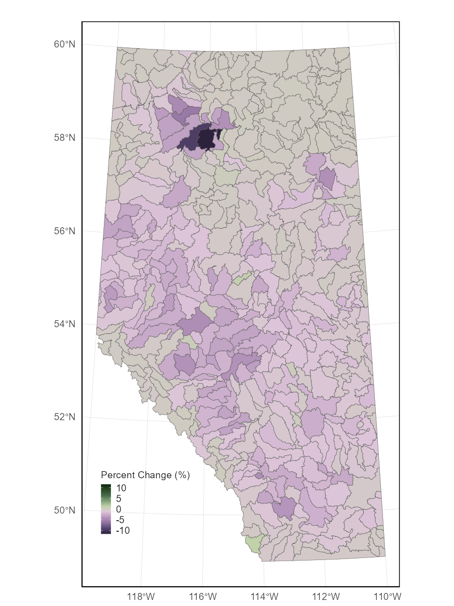
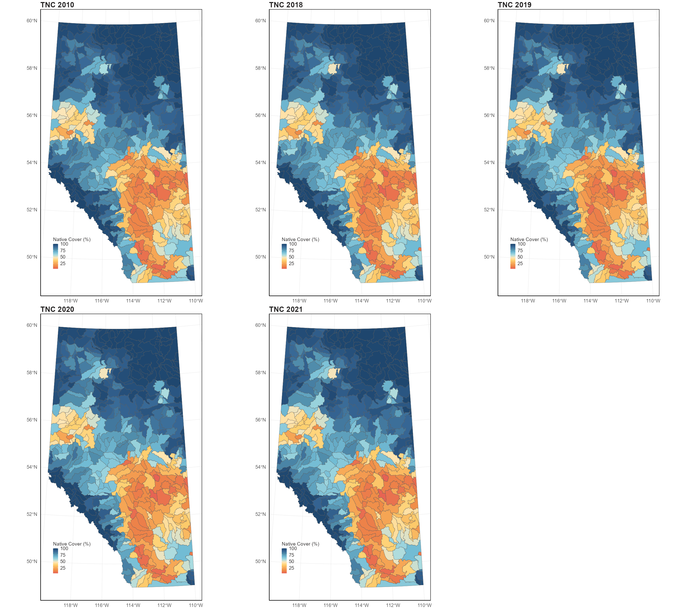

# Measuring Native Cover

## Aquatic Native Cover
Across all HUC-8 watersheds, AWNC values ranged from 10.6% to 100%, with provincial average values of 79.7%,
79.0%, 78.8%, 78.7% and 78.6% respectively, for 2010, 2018, 2019, 2020 and 2021. AWNC was high in northern Alberta and the Rocky Mountains for all five time steps, as indicated by higher indicator values. On the other hand, lower amounts of AWNC were detected in more developed areas such as the southern part of the province.

{width=80%}

AWNC conditions declined from 2010 to 2021 for most watersheds, with an average decline of 1.1% (SD = 1.24)
across all watersheds in the province. Of the 422 HUC-8 watersheds, AWNC increased in 28 watersheds, decreased in 389 watersheds, and was stable in 5 watersheds. For the 28 watersheds that observed increases, only 2 had increases greater than 0.5%, while 21 had increases smaller than 0.1%. Of the 389 watersheds experiencing declines, 79 watersheds experienced declines greater than 2%. For one watershed (HUC 18050404), indicator condition declined 11.6% over the 11-year period, from 79.2% to 67.6%. 

{width=80%}

## Terrestrial Native Cover
Across all HUC-8 watersheds, TNC values ranged from 3.9% to 100%, with provincial average values of 69.0%, 67.6%, 67.2%, 67.0% and 66.8% respectively, for 2010, 2018, 2019, 2020 and 2021. Similar trends to AWNC conditions were observed for TNC conditions. TNC was high in northern Alberta and the Rocky Mountains, with lower amounts of TNC detected in more developed areas. 

{width=80%}

Across the province, TNC decreased by an average of 2.15% (SD = 2.69) from 2010 to 2021. Of the 422 HUC-8 watersheds, TNC increased in 34 watersheds, decreased in 383, and was stable in 5 watersheds. For the 34 watersheds that observed increases, only 6 had increases greater than 0.5%, while 21 had increases smaller than 0.1%. Of the 383 watersheds experiencing declines, TNC decreased more than 2% in 154 watersheds, more than 5% in 56 watersheds, and more than 10% in 13 watersheds. For one watershed (HUC 18050101), indicator condition declined 13.9% over the 11-year period, from 78.1% to 64.2%. 

{width=80%}

## Limitations and Future Improvements

All indicators, as representations of a component of the environment, have limitations. A single indicator cannot
measure all aspects of habitat quantity and quality. The Native Cover indicator is intended to serve as a general
indicator of habitat quantity at the regional and sub-regional levels.

Currently, clearcut harvest areas are the only type of footprint that is allowed to recover in the calculation of AWNC
and TNC. Recovery for other footprint types (e.g., seismic lines, wellpads) will not be accounted for until sufficient
supporting information becomes available. 

Potential future improvements include:
• incorporating recovery for other human footprint types and refining the recovery curves for forest harvest areas,
• attributing changes in AWNC and TNC to relevant reporting sectors, and
• acquiring new wetland inventories that better represent wetland loss over time.